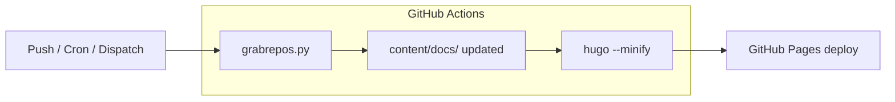

# 🏊 Smart Swimming Pool

[](https://github.com/smart-swimmingpool/website/actions/workflows/deploy-hugo.yml)
[](https://www.home-assistant.io/)
[](LICENSE)

**Smart Swimming Pool** is an open-source project to automate your swimming pool using home automation. Control circulation, heating, and monitoring — all from your smartphone.

🌐 **Website:** [smart-swimmingpool.com](https://smart-swimmingpool.com)

## Modules

| Module | Description |
|--------|-------------|
| [Pool Controller](https://github.com/smart-swimmingpool/pool-controller) | ESP32-based control unit with Home Assistant MQTT discovery. The smart brain of your pool. |
| [openHAB Configuration](https://github.com/smart-swimmingpool/openhab-config) | Sitemap and rules to control your pool via openHAB mobile app. |
| [Pool Monitor](https://github.com/smart-swimmingpool/monitor) | Solar-powered wireless temperature display for your pool. |
| [Grafana Dashboard](https://github.com/smart-swimmingpool/grafana-dashboard) | Visualize pool data with a beautiful Grafana dashboard. |

## Features

- ✅ Automated circulation for water cleaning
- ✅ Solar-powered ecological temperature control
- ✅ Open Source (MIT License)
- ✅ Works with Home Assistant (MQTT discovery)
- ✅ Works without permanent WiFi connection
- ✅ Modular and extensible

## Getting Started

Head over to the **[Getting Started guide](https://smart-swimmingpool.com/docs/getting-started/)** to set up your smart swimming pool.

---

## Contributing

We welcome contributions! Here's how to get started with developing the website locally.

### Prerequisites

- **Hugo (extended)** v0.162.1 or later — [Install Hugo](https://gohugo.io/installation/)
- **Python** 3.x — required for the documentation merge script (`grabrepos.py`)
- **Git** — with submodule support

### Local Development Setup

```bash
# 1. Clone the repository with submodules (for the theme)
git clone --recursive https://github.com/smart-swimmingpool/website.git
cd website

# 2. (Optional) Create a Python virtual environment and install dependencies
python3 -m venv .venv
source .venv/bin/activate   # On Windows: .venv\Scripts\activate
pip install -r requirements.txt

# 3. Start the Hugo development server with live reload
hugo server -D
```

The site will be available at `http://localhost:1313`. Changes to content, layouts, and config are reflected immediately.

### Project Structure

```
├── assets/              # CSS, JS, images (processed by Hugo)
├── content/             # Page content in Markdown
│   ├── docs/            # Documentation pages
│   │   ├── pool-controller/       # Generated by grabrepos.py (gitignored)
│   │   ├── openhab-configuration/ # Generated by grabrepos.py (gitignored)
│   │   ├── grafana-dashboard/     # Generated by grabrepos.py (gitignored)
│   │   └── pool-monitor/          # Generated by grabrepos.py (gitignored)
│   ├── _index.md        # Home page (English)
│   └── _index.de.md     # Home page (German)
├── docs/                # GitHub-published docs (trigger-website-rebuild)
├── i18n/                # Translation files
├── layouts/             # Custom Hugo templates
├── static/              # Static files (images, CNAME, etc.)
├── temp/                # gitignored, auto-created by grabrepos.py
├── themes/hextra/       # Hextra theme (git submodule)
├── grabrepos.py         # Script to merge module documentation
├── hugo.yaml            # Hugo configuration
├── multiversion.yml     # Multi-version content configuration
└── .opencode/           # Opencode AI agent skill definitions (internal)
```

### Common Tasks

| Task | Command |
|------|---------|
| Start dev server | `hugo server -D` |
| Build for production | `hugo --minify` |
| Clean build cache | `hugo --cleanDestinationDir` |
| Merge module docs | `python grabrepos.py` |
| Update theme | `git submodule update --remote themes/hextra` |

### Making Changes

1. **Fork** the repository on GitHub
2. **Create a branch** with a descriptive name (e.g. `fix/typo-in-docs`, `feat/new-contributor-guide`)
3. **Make your changes** and test locally with `hugo server -D`
4. **Commit** with a clear message describing what and why
5. **Open a Pull Request** against the `main` branch

### Code Style

- **Markdown**: Wrap lines at ~80 characters for readability. Use semantic line breaks.
- **Front matter**: Use YAML format. Required fields: `title`, `date` (if dated content).
- **Images**: Place in `static/img/` and reference with `/img/...` in Markdown. Optimize images before committing.
- **Translations**: German pages (`*.de.md`) should mirror the English version's structure. Update both when adding or changing content.

### How Module Documentation Updates Work

The website pulls documentation from separate module repositories (pool-controller, openhab-config, grafana-dashboard, monitor) via `grabrepos.py`. The build process:

1. **Reads `multiversion.yml`** to find which repos to include and their file patterns
2. **Clones (or fetches)** each repo into `temp/`
3. **For each `.md` file** matching the pattern:
   - Extracts YAML frontmatter (title, tags, date, etc.) and preserves it
   - `_index.md` files are always written as landing pages
   - Other files are split by `##` headings (files without any headings are skipped)
   - Writes to `content/docs/{modulename}/` with combined frontmatter
4. Generated module docs are **gitignored** — never committed to the repo

#### Edge Cases Handled by `grabrepos.py`

- **No `##` headings in `_index.md`**: Always written regardless (landing pages)
- **Malformed YAML** (e.g. `summary:Überwache` — missing space after colon): Gracefully degraded — empty metadata, body still correctly extracted
- **Internal documents**: Skipped when frontmatter has `noindex: true` + `private: true`

#### Build Triggers

| Trigger | Method |
|---------|--------|
| Push to `main` | GitHub Actions CI |
| Daily 6:00 UTC | Cron in `deploy-hugo.yml` |
| Module doc change | `repository_dispatch` `doc_update` |
| Manual | GitHub Actions → "Run workflow" |

> 💡 **For module maintainers**: Add this workflow to your module repo to trigger a rebuild automatically when docs change:
> ```yaml
> # .github/workflows/trigger-website-rebuild.yml
> name: Trigger Website Rebuild
> on:
>   push:
>     branches: [main]
>     paths: ["docs/**"]
> jobs:
>   trigger:
>     runs-on: ubuntu-latest
>     steps:
>       - name: Repository Dispatch
>         uses: peter-evans/repository-dispatch@v3
>         with:
>           token: ${{ secrets.WEBSITE_DISPATCH_TOKEN }}
>           repository: smart-swimmingpool/website
>           event-type: doc_update
> ```
> 
> A full step-by-step guide is available at [`docs/trigger-website-rebuild.md`](docs/trigger-website-rebuild.md) (also available in German).

#### Build Pipeline (CI Workflow)



### Development Tips

- Use `hugo server -D --navigateToChanged` to automatically open the browser when editing content.
- The Hextra theme is included as a git submodule. To preview theme changes, either submit them upstream or override templates in the `layouts/` directory.

## License

MIT — see [LICENSE](LICENSE).

---

<p align="center">
  Made with ❤️ by the Smart Swimming Pool community
</p>
