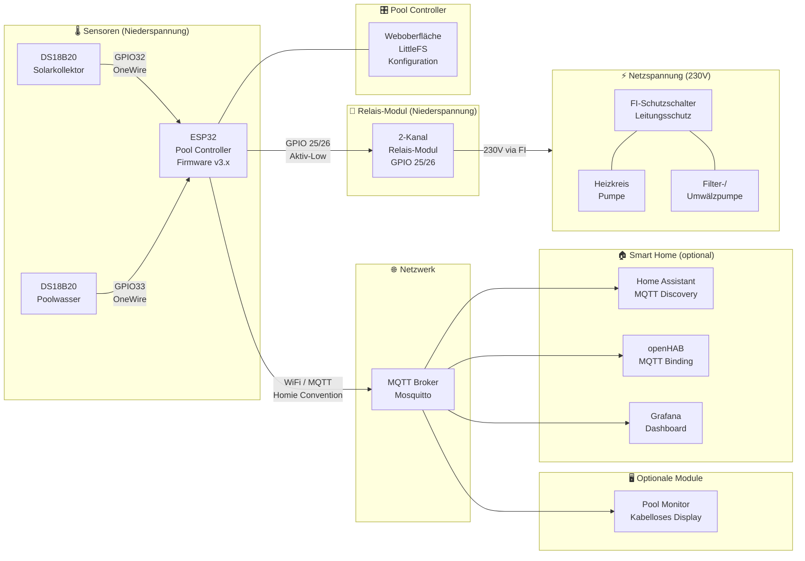

**🏊 Smart Swimming Pool: Systemarchitektur und Datenfluss im Überblick.**

Diese Seite beschreibt, wie die Hardware-Komponenten, Software-Module und Kommunikationsprotokolle in einer typischen Smart-Swimming-Pool-Installation zusammenwirken.

## Systemübersicht

Das folgende Diagramm zeigt alle Hauptkomponenten und ihre Verbindungen:

### Legende

| Element | Bedeutung |
|---------|-----------|
| **Durchgehender Pfeil** | Direkte elektrische Verbindung |
| **Netzwerk-Pfeil** | Netzwerk- / MQTT-Verbindung |
| **230V (Netzspannung)** | Hochspannungsseite — elektrische Sicherheit beachten |
| **Niederspannung** | 3,3V / 5V Seite — arbeitssicher bei Netztrennung |

---

## Komponentenbeschreibungen

### Sensoren (Niederspannung)

| Komponente | Typ | Anschluss | Zweck |
|-----------|------|-----------|-------|
| **Solarkollektor-Sensor** | DS18B20 (wasserdicht) | GPIO32 via OneWire | Misst Temperatur am Kollektoraustritt |
| **Poolwasser-Sensor** | DS18B20 (wasserdicht) | GPIO33 via OneWire | Misst die Pool-Wassertemperatur |

Beide Sensoren teilen sich 3,3V und GND. Jede Datenleitung benötigt einen **4,7kΩ Pull-Up-Widerstand** nach 3,3V.

### Pool Controller

Der **ESP32** führt die Pool-Controller-Firmware aus, welche:

- Beide DS18B20-Temperatursensoren via OneWire ausliest
- Die Heizungslogik implementiert (Hysterese, Temperaturschwellen)
- Die Zirkulationssteuerung übernimmt (Timer, temperaturbasiert)
- Alle Daten via **MQTT** nach der **Homie-Convention** veröffentlicht
- Eine **Weboberfläche** zur Konfiguration bereitstellt (LittleFS)
- Befehle via MQTT und Web-UI entgegennimmt
- Vollständig **autark** arbeitet — kein Smart-Home-Server erforderlich

### Relais-Modul

Ein Standard **2-Kanal-5V-Relais-Modul** (Aktiv-Low):

| Kanal | GPIO | Steuert |
|-------|------|---------|
| Relais 1 | GPIO25 | Heizkreispumpe |
| Relais 2 | GPIO26 | Filter-/Umwälzpumpe |

Das Relais-Modul sorgt für **galvanische Trennung** zwischen ESP32 (Niederspannung) und den Pumpen (230V). Pumpen immer über einen **FI-Schutzschalter** anschließen.

### Netzspannungsseite (230V)



- **Heizkreispumpe**: Zirkuliert Poolwasser durch den Wärmetauscher
- **Filter-/Umwälzpumpe**: Betreibt die Sandfilteranlage nach Zeitplan
- **FI-Schutzschalter (RCD)**: Vorschriftsmäßige Schutzeinrichtung gegen Fehlerströme
- **Leitungsschutzschalter**: Überstromschutz für jeden Pumpenstromkreis

> ⚠️ Alle 230V-Installationen müssen den örtlichen Elektrovorschriften entsprechen. Im Zweifel einen Elektriker hinzuziehen.

---

## Datenfluss

1. **Sensor-Messung**: ESP32 liest Temperaturen von DS18B20-Sensoren via OneWire
2. **Steuerlogik**: Firmware wertet Heizungs- und Zirkulationsregeln aus (autark, kein Server nötig)
3. **MQTT-Veröffentlichung**: Alle Sensorwerte, Schaltzustände und Diagnosedaten werden an den MQTT-Broker gesendet (Homie-Convention)
4. **Smart-Home-Integration**: Home Assistant, openHAB oder Grafana abonnieren MQTT-Themen zur Visualisierung und Automatisierung
5. **Aktorik**: ESP32 steuert das Relais-Modul zum Schalten der Pumpen

### Wichtige Design-Entscheidungen

| Entscheidung | Begründung |
|-------------|-----------|
| **Steuerlogik auf ESP32** | System bleibt voll funktionsfähig, auch wenn WiFi oder Smart-Home-Server offline sind |
| **Homie MQTT-Convention** | Standardisierte Auto-Discovery, lose Kopplung, funktioniert mit jedem MQTT-kompatiblen System |
| **Aktiv-Low Relais** | Kompatibel mit gängigen Relais-Modulen; beim ESP32-Start sind GPIOs HIGH = Relais AUS (sicher) |
| **Getrennter GPIO pro Sensor** | Ermöglicht unabhängige Fehlererkennung; bei Ausfall eines Sensors arbeitet der andere weiter |

---

## Optionale Module

Die Architektur unterstützt mehrere optionale Erweiterungen:

| Modul | Zweck | Integration |
|-------|-------|-------------|
| **Home Assistant** | Vollständiges Dashboard, Automationen, Benachrichtigungen | MQTT Discovery (automatisch) |
| **openHAB** | Sitemap-basierte Steuerung | MQTT Binding |
| **Grafana Dashboard** | Historische Datenvisualisierung | MQTT → InfluxDB → Grafana |
| **Pool Monitor** | Solarbetriebenes, kabelloses Temperaturdisplay | MQTT-Abonnement |
| **Smart Analyzer** (geplant) | Wasserqualitätsüberwachung | MQTT (zukünftig) |

---

## Verwandte Seiten

- [Erste Schritte](/docs/getting-started/) — Eigenen Pool Controller bauen
- [Home Assistant Integration](/docs/home-assistant-integration/) — Dashboard- und Automations-Guide
- [FAQ & Fehlerbehebung](/docs/troubleshooting/) — Häufige Probleme und Lösungen
