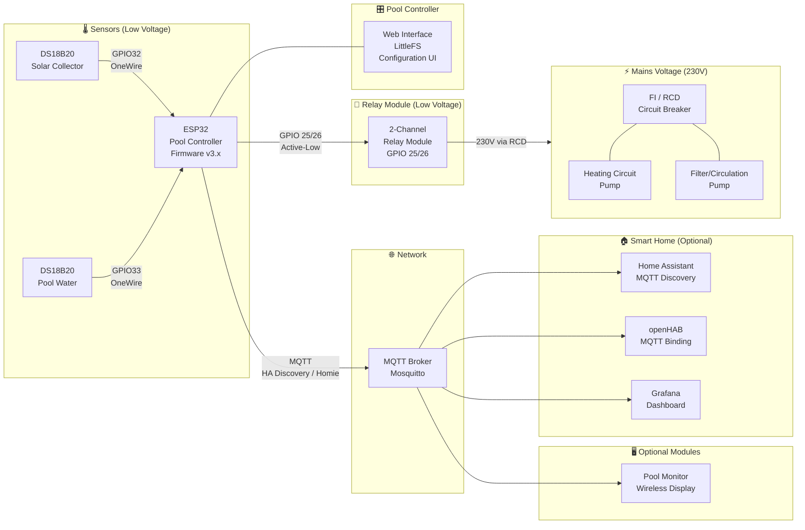

**🏊 Smart Swimming Pool: System architecture and data flow overview.**

This page describes how the hardware components, software modules, and communication protocols work together in a typical Smart Swimming Pool installation.

## System Overview

The following diagram shows all major components and how they connect:

### Diagram Legend

| Element | Meaning |
|---------|---------|
| **Solid arrow** | Direct electrical connection |
| **Dotted/network arrow** | Network / MQTT connection |
| **230V (Mains)** | High-voltage side — observe electrical safety |
| **Low Voltage** | 3.3V / 5V side — safe to work on when disconnected from mains |

---

## Component Descriptions

### Sensors (Low Voltage)

| Component | Type | Connection | Purpose |
|-----------|------|-----------|---------|
| **Solar Collector Sensor** | DS18B20 (waterproof) | GPIO32 via OneWire | Measures temperature at solar collector outlet |
| **Pool Water Sensor** | DS18B20 (waterproof) | GPIO33 via OneWire | Measures pool water temperature |

Both sensors share the same 3.3V supply and GND. Each data line requires a **4.7kΩ pull-up resistor** to 3.3V.

### Pool Controller

The **ESP32** runs the pool controller firmware, which:

- Reads both DS18B20 temperature sensors via OneWire protocol
- Implements heating logic (hysteresis, temperature thresholds)
- Controls circulation scheduling (timer, temperature-based)
- Publishes all data via **MQTT** using the **Home Assistant MQTT Discovery** format (v3.x) or **Homie convention** (v2.x)
- Provides a **web interface** for configuration (LittleFS)
- Accepts commands via MQTT and web UI
- Operates fully **autonomously** — no smart home server required

### Relay Module

A standard **2-channel 5V relay module** (active-low):

| Channel | GPIO | Controls |
|---------|------|----------|
| Relay IN1 (Ch. 1) | GPIO26 | Heating circuit pump |
| Relay IN2 (Ch. 2) | GPIO25 | Filter/circulation pump |

The relay module provides **galvanic isolation** between the ESP32 (low voltage) and the pumps (230V). Always connect pumps through an **RCD/FI circuit breaker**.

### Mains Voltage Side (230V)



- **Heating circuit pump**: Circulates pool water through the heat exchanger
- **Filter/circulation pump**: Runs the sand filter system on a schedule
- **RCD / FI**: Mandatory safety device — protects against ground faults
- **Circuit breaker**: Overcurrent protection for each pump circuit

> ⚠️ All 230V wiring must comply with local electrical codes. If unsure, consult a licensed electrician.

---

## Data Flow

1. **Sensor Reading**: ESP32 reads temperatures from DS18B20 sensors via OneWire
2. **Control Logic**: Firmware evaluates heating and circulation rules (autonomous, no server needed)
3. **MQTT Publication**: All sensor values, switch states, and diagnostics are published to the MQTT broker using the Home Assistant MQTT Discovery format (v3.x)
4. **Smart Home Integration**: Home Assistant, openHAB, or Grafana subscribe to MQTT topics for visualization and automation
5. **Actuation**: ESP32 drives the relay module to switch pumps on/off

### Key Design Decisions

| Decision | Rationale |
|----------|-----------|
| **Control logic on ESP32** | System remains fully functional even when WiFi or the smart home server is offline |
| **MQTT Discovery (HA / Homie)** | Standardized auto-discovery, loose coupling; v3.x uses Home Assistant MQTT Discovery, v2.x used Homie convention |
| **Active-low relays** | Matches common cheap relay modules; during ESP32 boot, GPIOs are HIGH = relays stay OFF (failsafe) |
| **Separate GPIO per sensor** | Allows independent fault detection; if one sensor fails, the other continues working |

---

## Optional Modules

The architecture supports several optional add-ons:

| Module | Purpose | Integration |
|--------|---------|-------------|
| **Home Assistant** | Full dashboard, automations, notifications | MQTT Discovery (automatic) |
| **openHAB** | Sitemap-based control | MQTT Binding |
| **Grafana Dashboard** | Historical data visualization | MQTT → InfluxDB → Grafana |
| **Pool Monitor** | Solar-powered wireless temperature display | MQTT subscription |
| **Smart Analyzer** (planned) | Water quality monitoring | MQTT (future) |

---

## Related Pages

- [Getting Started](/docs/getting-started/) — Build your own pool controller
- [Home Assistant Integration](/docs/home-assistant-integration/) — Dashboard and automation guide
- [FAQ & Troubleshooting](/docs/troubleshooting/) — Common problems and solutions
