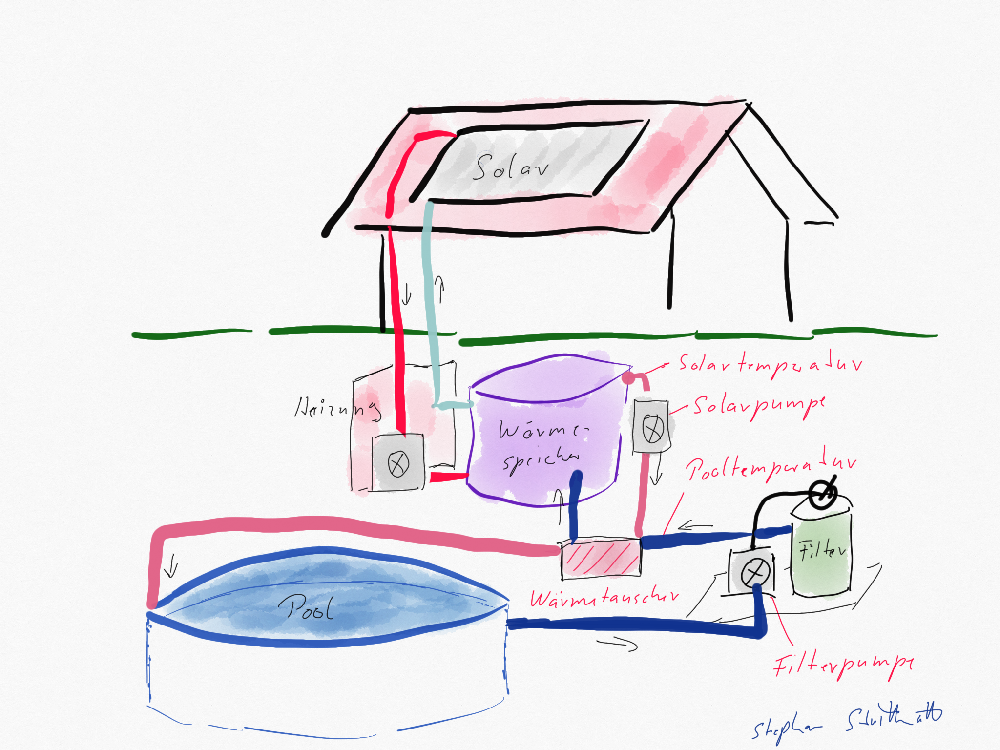

**🏊 Smart Swimming Pool: Home automation for smarter control of your swimming pool**



## Example Environment

In a typical setup, a thermal solar system heats water and supports the home heating system. The heated water is stored in a buffer tank, which has a third circulation loop for the pool. A pump attached to this loop circulates pool water through a heat exchanger:



## Basic Requirements

- Swimming pool with sand filter system
- Heating circuit with a pump-switchable heat exchanger
- Solar heat storage tank with an additional heating circuit for the pool

## Parts List (Bill of Materials)

| Component | Est. Price | Notes |
|-----------|-----------|-------|
| ESP32 DevKit V1 | 10–15 € | At least 4MB flash, USB cable included |
| DS18B20 temperature sensor (2x, waterproof) | 8–12 € | Stainless steel probe, 1m cable |
| 2-Channel Relay Module (Dual relay) | 5–8 € | **Must be active-high!** See notes below |
| 4.7kΩ resistors (2x) | < 1 € | Pull-up resistors for OneWire bus |
| Breadboard + jumper wires | 3–8 € | For prototyping; use perfboard for permanent build |
| USB power supply (5V / 1A+) | 5–10 € | For ESP32 + relay module |
| Enclosure (IP54+) | 5–10 € | Optional but recommended for outdoor use |
| **Total** | **~45–75 €** | **Excluding pool pump / heat exchanger infrastructure** |

> **⚠️ Relay module warning:** Many cheap relay modules are **active-low** (relay turns ON when GPIO is LOW). The firmware assumes **active-high** relays (GPIO HIGH = relay ON). If you have active-low modules, the heater/circulation pump will be stuck ON at boot. Check your module's datasheet or use a multimeter to verify. See the [FAQ](/docs/troubleshooting) for help.

## Hardware Assembly

### Breadboard Layout


*The ESP32 and relay module on a breadboard — the simplest way to get started.*

### Step 1: Prepare the ESP32

1. Connect the ESP32 to your computer via USB.
2. Verify it appears as a serial port (`/dev/ttyUSB0` on Linux, `COM3` on Windows).
3. Install **CP210x** or **CH340** drivers if needed ([CP210x drivers](https://www.silabs.com/developers/usb-to-uart-bridge-vcp-drivers), [CH340 drivers](https://www.wch.cn/download/CH341SER_EXE.html)).

### Step 2: Connect the Temperature Sensors

The DS18B20 sensors use the **OneWire protocol**. Connect them as follows:

| ESP32 Pin | Component | Wire Color (typical) |
|-----------|-----------|---------------------|
| 3.3V | DS18B20 VDD (pin 3) | Red |
| GND | DS18B20 GND (pin 1) | Black |
| GPIO32 | DS18B20 DATA (pin 2) | Yellow/White |

> **Important:** Connect a **4.7kΩ resistor** between the DATA line and 3.3V (pull-up). This is required for OneWire to work reliably. For two sensors, a single pull-up resistor is sufficient.

### Step 3: Connect the Relay Module

| ESP32 Pin | Relay Module | Notes |
|-----------|-------------|-------|
| GPIO26 | Relay IN1 | Heating circuit pump |
| GPIO25 | Relay IN2 | Circulation/filter pump |
| 5V (VIN) | Relay VCC | **5V** not 3.3V! |
| GND | Relay GND | Common ground with ESP32 |

> **⚠️ Power:** The relay module requires **5V** power (use the ESP32's VIN pin when powered via USB). Do not power it from the 3.3V pin. Connect the ESP32 GND to the relay module GND (common ground).

### Step 4: Final Checks

Before connecting any pump or mains voltage:
1. Double-check all connections against the schematic.
2. Verify the relay module is **active-high** (LED on = relay closed).
3. Flash the firmware first (see below) and test with the web interface **without** connecting pumps.
4. Still no 230V mains? Only connect pump/valve wiring after successful firmware tests.

## Firmware Installation

### Option A: PlatformIO (Recommended)

1. Install [Visual Studio Code](https://code.visualstudio.com/) and the [PlatformIO extension](https://platformio.org/install/ide?install=vscode).
2. Clone the repository:
   ```bash
   git clone https://github.com/smart-swimmingpool/pool-controller.git
   cd pool-controller
   ```
3. Open the folder in VS Code — PlatformIO will auto-detect the project.
4. Connect the ESP32 via USB.
5. Click the **→ (Upload and Monitor)** button in the PlatformIO footer bar.
6. The firmware will compile and flash. The serial monitor opens automatically at 115200 baud.

### Option B: Arduino IDE

1. Install the [Arduino IDE](https://www.arduino.cc/en/software) (version 2.x recommended).
2. Add ESP32 board support:
   - File → Preferences → Additional Boards Manager URLs:
     `https://raw.githubusercontent.com/espressif/arduino-esp32/gh-pages/package_esp32_index.json`
   - Tools → Board → Boards Manager → search "ESP32" → install
3. Install required libraries:
   - **ArduinoJson 7.x** (Library Manager)
   - **PubSubClient** (Library Manager)
   - **NTPClient** (Library Manager)
4. Open `pool-controller.ino` from the cloned repository.
5. Select **ESP32 Dev Module** under Tools → Board.
6. Select the correct COM port.
7. Click **Upload**.

### Verify the Flash

After flashing, open the serial monitor (115200 baud). You should see:

```
[INFO] Pool Controller v3.3.0 starting...
[INFO] WiFi: Starting in AP mode
[INFO] AP: SmartPool-XXXXXXXXXXXX
```

The ESP32 starts in **Access Point (AP) mode** by default.

## First Run & Configuration

### Step 1: Connect to the ESP32

1. Scan for WiFi networks — you'll see `SmartPool-XXXXXXXXXXXX` (no password).
2. Connect to it from your phone or laptop.
3. Open a browser and go to **http://192.168.4.1**

### Step 2: Configure WiFi

1. The web interface shows a configuration page.
2. Enter your home WiFi SSID and password.
3. Click **Save** — the ESP32 will reboot and connect to your network.

### Step 3: Set up MQTT

1. Find the ESP32's IP address on your router or from the serial monitor.
2. Open `http://<esp32-ip>/` in your browser.
3. Go to **Configuration → MQTT**.
4. Enter your MQTT broker address (e.g., `192.168.1.100` or `core-mosquitto`).
5. If using authentication, enter username/password.
6. Click **Save** — the controller will reconnect to MQTT.

> **No MQTT broker yet?** Install [Mosquitto](https://mosquitto.org/download/) on any machine on your network, or use the Mosquitto add-on in Home Assistant.

### Step 4: Home Assistant Integration

If you use Home Assistant with MQTT configured:

1. The controller automatically publishes MQTT discovery messages.
2. In Home Assistant, go to **Settings → Devices & Services**.
3. Click **Add Integration → MQTT** (if not already configured).
4. The pool controller should appear as a new device automatically.
5. You'll see entities for:
   - Temperatures (pool, solar, outside)
   - Circulation pump switch
   - Heating circuit switch
   - System status sensors

### Step 5: Connect the Pumps

Only now — after verifying everything works:
1. **Disconnect** the ESP32 from USB power.
2. Wire the relay outputs to your pump contactors/valves.
3. Use appropriate cable cross-sections for 230V wiring.
4. Connect mains power through an **RCD (FI-Schutzschalter)**.
5. Power the ESP32 via its USB supply (keep it isolated from mains).



## Modular System Overview

The Getting Started guide focuses on the **Pool Controller**, which is the central module. The system has additional optional modules:

| Module | Purpose | When to Add |
|--------|---------|-------------|
| **Pool Controller** (this guide) | Main control: pumps, heating, circulation | Required — start here |
| **Pool Monitor** | Solar-powered wireless temperature display | After controller is running |
| **Grafana Dashboard** | Data visualization and history | When you want historical charts |
| **openHAB Configuration** | Integration with openHAB smart home | If you use openHAB instead of Home Assistant |
| **Smart Analyzer** *(planned)* | Water quality monitoring | Not yet available |

## What's Next?

Once your Pool Controller is running:
- Set up the **[Grafana Dashboard](/docs/grafana-dashboard/)** to visualize temperature trends
- Add the **[Pool Monitor](/docs/pool-monitor/)** for a dedicated display
- Check the **[FAQ](/docs/troubleshooting/)** if you run into issues
- Explore the **[openHAB Configuration](/docs/openhab-configuration/)** if you use openHAB

## Preparations

If a heating circuit with a heat exchanger is in place, you can start implementing the smart pool control.

The heart of the system is the [Pool Controller](https://github.com/smart-swimmingpool/pool-controller). It handles:

- Circulation scheduling for sand filter cleaning
- Switching on the heating circuit to warm the pool water
- Reporting status and temperature data for integration with Smart Home servers

The [Pool Controller](https://github.com/smart-swimmingpool/pool-controller) uses [Home Assistant MQTT discovery](https://www.home-assistant.io/integrations/mqtt/#mqtt-discovery) for seamless smart home integration. With the configuration presented here, the pool controller can be quickly set up and controlled from any Home Assistant-compatible app.

### Home Assistant Dashboard

The pool controller automatically registers all sensors and controls in Home Assistant via MQTT discovery. Below is an example of the dashboard and the corresponding configuration entries:


*Pool Controller entities shown in the Home Assistant dashboard*


*MQTT discovery device entry with all sensors and controls*


*Configuration entries for the pool controller in Home Assistant*

## History

🏊 Smart Swimming Pool originated from an [earlier project](https://github.com/stritti/smart-swimming-pool) that was not yet modular and had all control logic implemented as openHAB rules.

The first version ran in **Summer 2018** and revealed several weaknesses:

- Controlling pumps via 433 MHz socket switches was unreliable — no feedback meant the actual state was unknown
- Switching logic lived in openHAB rules, causing problems when WiFi was unreliable
- MQTT messages used a proprietary format

Based on these lessons, the revised 🏊 Smart Swimming Pool was built: modular, resilient, and standards-based.
