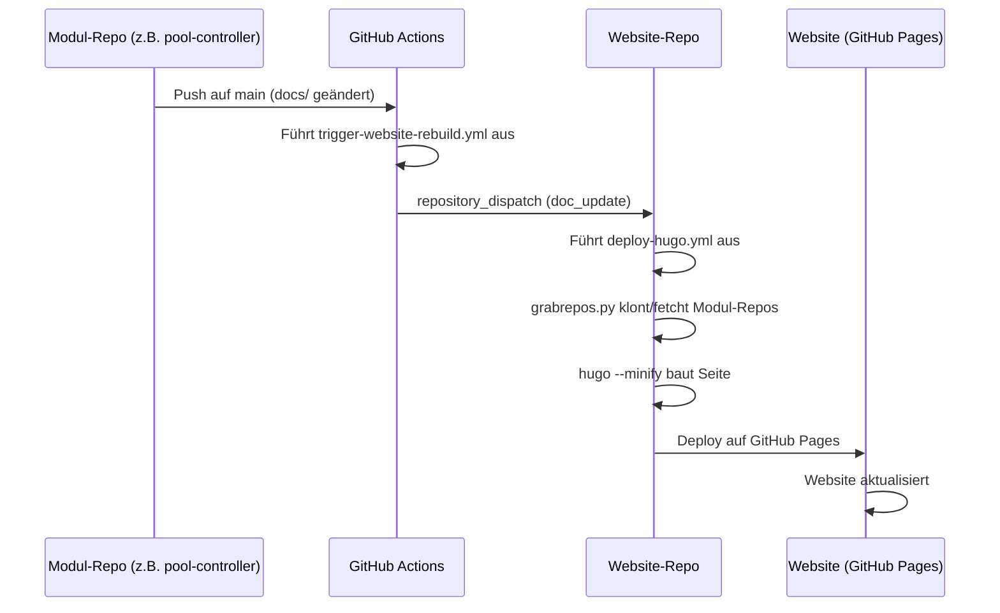

# Automatischer Website-Rebuild bei Doc-Änderungen

Wenn du ein Modul wie `pool-controller`, `openhab-config`, `grafana-dashboard` oder `monitor` betreust, kannst du dafür sorgen, dass die Website **automatisch neu gebaut wird**, sobald sich die Dokumentation in deinem Repository ändert.

So sparst du dir, manuell im Website-Repo einen Build anstoßen zu müssen.

## Kurzanleitung

### 1. Personal Access Token erstellen

Erstelle ein GitHub Personal Access Token (Classic) mit dem Scope `repo`:

1. Gehe zu [GitHub → Settings → Developer settings → Personal access tokens → Tokens (classic)](https://github.com/settings/tokens)
2. Klicke **Generate new token (classic)**
3. Name: `WEBSITE_DISPATCH`
4. Scope: `repo` (vollständig auswählen)
5. Token kopieren

### 2. Secret im Modul-Repository hinterlegen

1. Gehe zu deinem Modul-Repo auf GitHub (z.B. `smart-swimmingpool/pool-controller`)
2. **Settings → Secrets and variables → Actions**
3. **New repository secret**
   - Name: `WEBSITE_DISPATCH_TOKEN`
   - Secret: Das kopierte Token einfügen
   - **Add secret**

### 3. GitHub Action Workflow erstellen

Erstelle in deinem Modul-Repo die Datei `.github/workflows/trigger-website-rebuild.yml` mit folgendem Inhalt:

```yaml
name: Trigger Website Rebuild

on:
  push:
    branches:
      - main
    paths:
      - "docs/**"

jobs:
  trigger:
    runs-on: ubuntu-latest
    steps:
      - name: Repository Dispatch
        uses: peter-evans/repository-dispatch@v3
        with:
          token: ${{ secrets.WEBSITE_DISPATCH_TOKEN }}
          repository: smart-swimmingpool/website
          event-type: doc_update
```

### 4. Testen

1. Ändere eine `.md`-Datei im `docs/`-Ordner deines Modul-Repos
2. Pushe auf `main`
3. Der Workflow **Trigger Website Rebuild** sollte automatisch starten
4. Nach erfolgreichem Dispatch wird der Workflow **CI** im Website-Repo ausgelöst
5. Die Website ist nach ca. 2–3 Minuten aktualisiert

## Wie es funktioniert



## Fehlersuche

| Problem | Lösung |
|---------|--------|
| Workflow startet nicht | Prüfe, ob der Pfad `docs/**` korrekt ist und ob der Push auf `main` erfolgt |
| Dispatch schlägt fehl | Prüfe, ob `WEBSITE_DISPATCH_TOKEN` gesetzt ist und `repo`-Scope hat |
| Website wird nicht aktualisiert | Prüfe den **CI**-Workflow im [Website-Repo](https://github.com/smart-swimmingpool/website/actions) |
| Kein Token vorhanden | Frage im Team nach einem gültigen Token oder erstelle einen neuen |

## Alternative: Täglicher Rebuild (kein Token nötig)

Falls du keinen Token verwenden möchtest, kein Problem: Die Website wird **automatisch jeden Tag um 6:00 UTC** neu gebaut und holt sich dabei die aktuellste Dokumentation aus allen Modul-Repos. Änderungen sind dann spätestens am nächsten Morgen live.
