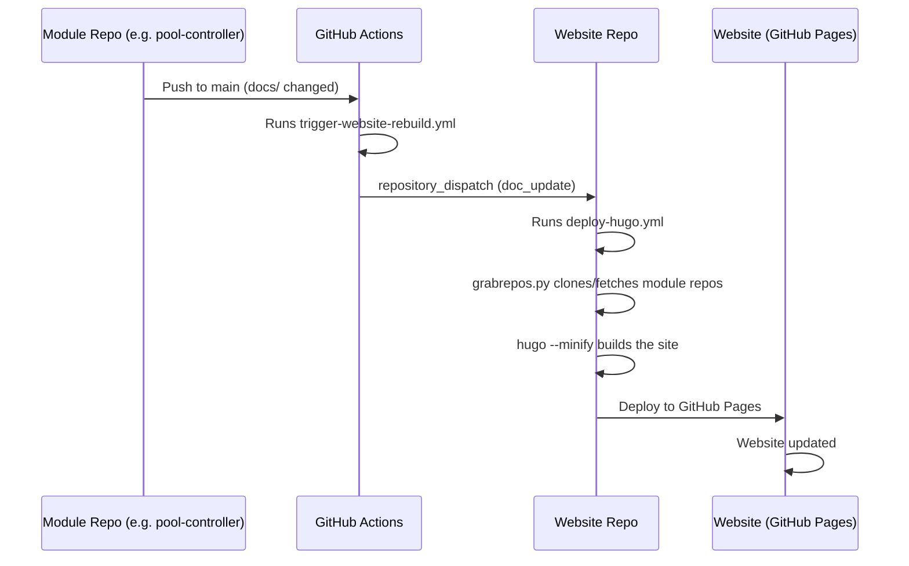

# Automatic Website Rebuild on Doc Changes

If you maintain a module like `pool-controller`, `openhab-config`, `grafana-dashboard`, or `monitor`, you can set up the website to **rebuild automatically** whenever documentation in your repository changes.

No more manually triggering builds in the website repo.

## Quick Start

### 1. Create a Personal Access Token

Create a GitHub Personal Access Token (classic) with the `repo` scope:

1. Go to [GitHub → Settings → Developer settings → Personal access tokens → Tokens (classic)](https://github.com/settings/tokens)
2. Click **Generate new token (classic)**
3. Name: `WEBSITE_DISPATCH`
4. Scope: `repo` (select all)
5. Copy the token

### 2. Add the Token as a Secret

1. Go to your module's repository on GitHub (e.g., `smart-swimmingpool/pool-controller`)
2. **Settings → Secrets and variables → Actions**
3. **New repository secret**
   - Name: `WEBSITE_DISPATCH_TOKEN`
   - Secret: Paste the copied token
   - Click **Add secret**

### 3. Create the GitHub Action Workflow

Create `.github/workflows/trigger-website-rebuild.yml` in your module repository:

```yaml
name: Trigger Website Rebuild

on:
  push:
    branches:
      - main
    paths:
      - "docs/**"

jobs:
  trigger:
    runs-on: ubuntu-latest
    steps:
      - name: Repository Dispatch
        uses: peter-evans/repository-dispatch@v3
        with:
          token: ${{ secrets.WEBSITE_DISPATCH_TOKEN }}
          repository: smart-swimmingpool/website
          event-type: doc_update
```

### 4. Test It

1. Edit a `.md` file inside the `docs/` folder of your module repository
2. Push to `main`
3. The **Trigger Website Rebuild** workflow should start automatically
4. Once the dispatch succeeds, the **CI** workflow in the website repo will trigger
5. The website will be updated within approximately 2–3 minutes

## How It Works



## Troubleshooting

| Issue | Solution |
|-------|----------|
| Workflow doesn't start | Check that the `docs/**` path pattern matches and the push is on `main` |
| Dispatch fails | Verify `WEBSITE_DISPATCH_TOKEN` is set and has the `repo` scope |
| Website not updated | Check the **CI** workflow in the [Website Repo](https://github.com/smart-swimmingpool/website/actions) |
| No token available | Ask the team for a valid token or create a new one |

## Alternative: Daily Rebuild (No Token Required)

If you don't want to use a token, don't worry: the website **rebuilds automatically every day at 6:00 UTC** and pulls the latest documentation from all module repositories. Changes go live by the next morning at the latest.
